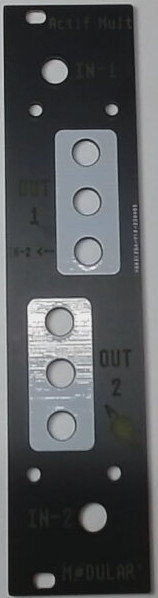

# Front_Panel

**Here an example of a design on Inkscape**

**Here the result after laserCutting and coloring fonts with white paint**

## Design software

**FREECAD**

Freecad is a free 2D and 3D drawing software. : https://www.freecad.org/
It allowed me to draw the module's outer contour and fixing holes.

Then I insert it into Inkscape to add images and texts.
But, why don't I use Inkscape at the beginning for the module's outer contour and fixing holes ?

Quite simply because Freecad lets me set dimensional constraints.
The outside size can be defined very precisely, and the fixing holes can be placed at an exact distance from the edge.
And, even if I change the outside dimension, the position and size of the fixing holes will remain the same.

I made files with the current front panel sizes

You will find them in the 2D files folder.

**INKSCAPE**

Inkscape is a free 2D vectoriel drawing software. https://inkscape.org/
In Inkscape you can create a 2D vector design with easy and pretty image and text insertion with also some tool to align holes of defined diameters for knob, switch, jacks, leds ... 
You can play with fonts, pictures and much more... :)

Here one of my design, you'll find the .svg on 2D files folder

There is also my generic page with all the necessary components (Jacks, Pots, switchs...)

You'll find them in .svg format the 2D files folder.

**KICAD**

Kicad is a free creating pcb software. https://www.kicad.org/
It is common to obtain front panels using this software.

You have to insert the svg file in Kicad, and define each drawing or writing on a layer of the PCB.

I wanted to make a documentation, but during my reading, I found some resources on synth front panel manufacturing that make me think I probably couldn't do better... :)

https://arx.wtf/blog/1-front-panels-tips

https://www.youtube.com/watch?v=m__D1doHVVk

## Fabrication

To obtain the next front panels you'll need a lasercutter. Like 3d printer you can find it in a fablab.

**Lasercut PMMA**

An example of lasercutted Pmma or plexiglas

1 - Rendering after laser cutting

2 - Paint for inking writings and drawings

3 - A tiling scraper to spread it all out so that it fits into the grooves.

4 - Leave to dry

5 - Take a wet cloth and rub to remove any paint that's not in the right place.

6 - Here's how it looks, when it's all finished (I'm not very fussy) we can do better ...

7 - The front panel with parts

8 - It's all over

**Lasercut WOOD**

Poplar plywood 3mm

There's less work after cutting for poplar plywood, as the engraving provides enough contrast to distinguish the writing and images.

**Lasergraving Dibond**

3mm dibond = Dibond® is an aluminum composite material (ACM). It is comprised of two pre-painted sheets of . 012″ (. 30mm) aluminum with a solid polyethylene core.

Most easy-to-find machines cannot engrave in aluminum.
But aluminum is painted, so engraving works in place of cutting.
However, you'll need to drill the holes with a drill press and cut the edge precisely.
But it's functional, quite pretty, and inexpensive, as sports clubs use this material for their advertising.
As their sponsors change, they no longer use the old panels...
On one side there's the advertising, on the other it's blank, ready to engrave, sometimes even with the protective layer still on :)

1 - Open your design in lightburn or other software to control the laser cutter, and choose what will be filled in (as if coloring the inside of a drawing) and what will be marked (as if drawing just the outline of the drawing).

2 - Engraving

I'm using an Atomstack X20 Pro

3 - Cleaning the engraving

To clean, I use toothpaste and a toothbrush, because it sands nicely without scratching too much.

4 - Cut and file the edges

To cut the edges, I use a wooden wedge to guide the hacksaw blade.

Edges need to be deburred to remove sharp edges

5 - Drill the holes

Make a mark with a punch, and drill the holes, start with a 3mm drill bit, then drill to 6mm for the jack and potentiometer etc.

Deburr the edges of the hole to remove the cutting edge

**Lasergraving Aluminium**

Most easy-to-find machines cannot engrave in aluminum. You need a fiber laser Cutter, and it's quite expensive ...
But aluminum can be painted, so engraving works in place of cutting.
But, you do need to protect the paint, however, as it will peel off. One solution is to apply a layer of transparent plastic adhesive.

However, you'll need to drill the holes with a drill press and cut the edge precisely.

**Etch PCB**

To obtain this quality of fabrication - Not the design :) - you'll need to send GERBER files to a PCB supplyer. 

**3d print**

It's also possible to 3d print the front panel. 
I use 3d panel only for blank panel

This website allows you to download and print eurorack parts. 

https://www.thingiverse.com/thing:1850240

https://www.thingiverse.com/search?q=eurorack&page=1&type=things&sort=relevant

## More resources on creating front panel

SDIY.info wiki 

* https://sdiy.info/wiki/Eurorack_panel_components

ModWiggler forum :

* https://modwiggler.com/forum/viewtopic.php?t=282087&sid=c586f268479aaaf0befdb3511445877c#top

* https://modwiggler.com/forum/viewtopic.php?t=235049

* https://modwiggler.com/forum/viewtopic.php?t=180347&start=400

A small table saw build in PVC, to cut the edges

* https://www.youtube.com/watch?v=B5hse3_FMNY

